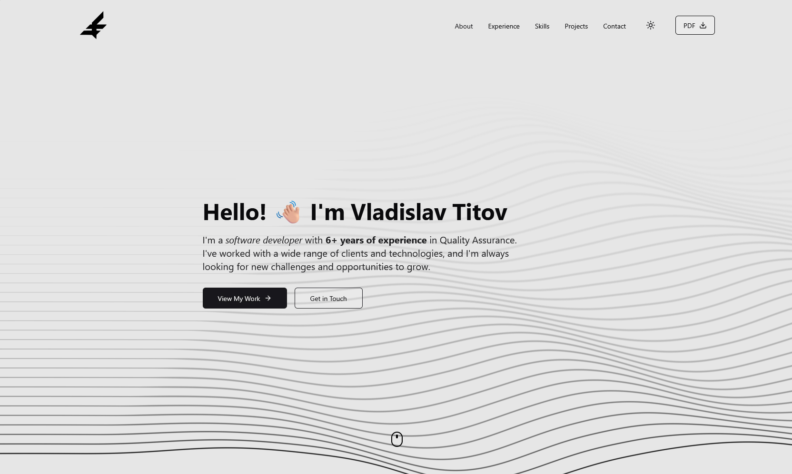

# Vladislav Titov Portfolio

A modern, interactive portfolio website built with Next.js, React, and Framer Motion showcasing my skills, projects, and professional experience.



## 🌟 Features

- **Interactive UI Elements**
  - Custom cursor follower that enhances user experience on desktop
  - Animated MetaBalls component with responsive behavior
  - Dynamic theme detection that automatically adapts to system preferences
  - Smooth animations and transitions using Framer Motion
  - Responsive design for all device sizes

- **Key Components**
  - Interactive threads background animation
  - Technology carousel showcasing skills with animated icons
  - Project filtering system
  - Contact form with validation
  - Experience timeline
  - Animated counters and text
  - Theme toggle (light/dark mode)

- **Performance Optimized**
  - Mobile-specific optimizations (disabled custom cursor and MetaBalls on small screens)
  - Dynamic imports for heavy components
  - Responsive images with Next.js Image optimization

## 🚀 Technologies

- **Frontend Framework**: Next.js 15
- **UI Library**: React 19
- **Styling**: Tailwind CSS
- **Animations**: Framer Motion
- **UI Components**: Radix UI
- **Icons**: Lucide React, React Icons
- **Form Handling**: React Hook Form with Zod validation
- **Theme Management**: next-themes

## 🛠️ Getting Started

### Prerequisites

- Node.js 18.x or higher
- npm or yarn

### Installation

1. Clone the repository
   ```bash
   git clone https://github.com/vvtitov/vt-portfolio.git
   cd vt-portfolio
   ```

2. Install dependencies
   ```bash
   npm install
   # or
   yarn install
   ```

3. Run the development server
   ```bash
   npm run dev
   # or
   yarn dev
   ```

4. Open [http://localhost:3000](http://localhost:3000) in your browser

## 📱 Responsive Behavior

- **Mobile Devices**: Custom cursor and MetaBalls component are disabled for better performance
- **Tablets & Desktops**: Full interactive experience with all animations enabled

## 🎨 Theme System

The portfolio features an automatic theme detection system that:
- Detects the user's system theme preference (light/dark)
- Updates in real-time when the system theme changes
- Allows manual theme toggling

## 🧩 Project Structure

```
vt-portfolio/
├── app/                  # Next.js app router structure
│   ├── api/              # API routes
│   ├── portfolio/        # Portfolio pages
│   ├── projects/         # Projects page
│   ├── services/         # Services page
│   └── page.tsx          # Homepage
├── components/           # Reusable components
│   ├── ui/               # UI components (MetaBalls, threads-bg, etc.)
│   └── ...               # Other components
├── context/              # React context providers
├── data/                 # Static data (projects, skills)
├── public/               # Static assets
└── styles/               # Global styles
```

## 📄 License

This project is licensed under the MIT License - see the LICENSE file for details.

## 📬 Contact

- GitHub: [@vvtitov](https://github.com/vvtitov)
- LinkedIn: [vladislavtitov](https://linkedin.com/in/vladislavtitov)
- Email: vladislavtitov.r@gmail.com

---

Built with ❤️ by Vladislav Titov
